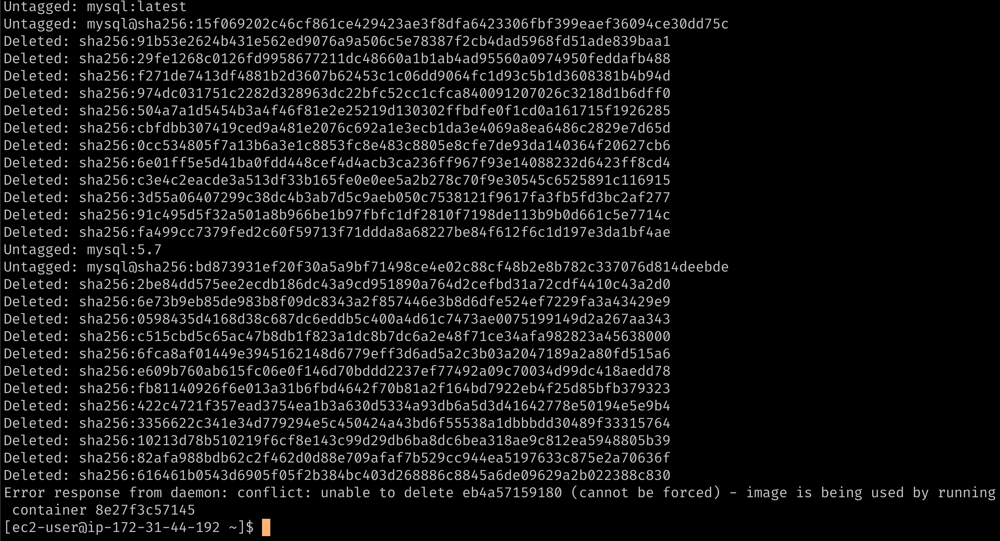

# Docker 命令

## 服务相关命令

启动 `docker` 服务

```sh

systemctl start docker

```

停止 `docker` 服务

```sh

systemctl stop docker

```

重启 `docker` 服务

```sh

systemctl restart docker

```

查看 `docker` 服务状态

```sh

systemctl status docker

```

设置开机启动 `docker` 服务

```sh

systemctl enable docker

```

## 镜像相关命令

搜索镜像

```sh

docker search tomcat

```

搜索结果如下:


拉取镜像

```sh

docker pull tomcat

```

我已经拉取过 `tomcat`,所以这里用拉取 `mysql` 来截个图, 不加 `tag` 的情况下, 默认拉取的就是 `latest`(最新版本) 拉取过程是有进度条的


拉取完成就是下面这样


:::tip

指定版本号, 格式如下:

`docker pull` _镜像名:版本号_

如果不知道 `tag` 有哪些, 可以去 [`Dockerhub`](https://hub.docker.com) 查看

:::

打开网站直接搜索目标镜像, 比如 `tomcat` 就会搜到如下结果:


点击结果进入详情页就可以查看到 `tag` 相关信息:


使用`Dockerfile`构建镜像

```sh

# docker build -t 镜像名:版本号 .  注意最后边的点 `.` 表示当前目录, 别丢了.
docker build -t my_image:1.0 .

```

`Docker` `build` 命令可以使用 `Dockerfile` 来构建镜像。默认情况下，`Dockerfile` 文件位于构建上下文的根目录下，因此 `docker build` 命令会自动读取上下文根路径下名为 `Dockerfile` 的文件。如果 `Dockerfile` 文件不在根目录下，可以使用 `-f` 选项来指定 `Dockerfile` 文件的路径。例如，以下命令将使用 `/path/to/Dockerfile` 文件构建镜像：

```sh

docker build -t -f /path/to/Dockerfile image_name:tag .

```

其中，`.` 表示当前目录. 这里先不细讲如何编写`Dockerfile`了

查看本地镜像

```sh

docker images

```

该命令将会列出从`Dockerhub`拉取的镜像和你自己使用 `docker build` 构建的镜像列表


查看本地镜像 `ID`

```sh

docker images -q

```

删除本地镜像

```sh

docker rmi mysql:5.7

# or

docker rmi 2be84dd575ee

```

:::tip

为了准确删除你的目标镜像, 建议删除有多个版本存在的镜像时, 使用镜像名+版本, 如果二者镜像 `ID` 不同也可以使用镜像 `ID` 进行删除, 防止误删

:::

全部删除本地镜像

```sh

docker rmi `docker images -q`

```

解释一下, `docker images -q` 这个命令可以列出全部本地镜像的 `ID`, 相当于把全部镜像 `ID` 传给了`docker rmi` 就实现全部删除效果了.





:::tip

如上图所示: `Error response from daemon: conflict: unable to delete eb4a57159180 (cannot be forced) - image is being used by running container 8e27f3c57145`

报了个错: 不能删除`ID`为`eb4a57159180`的镜像(是`nginx`镜像), 这个镜像被一个`ID`为`8e27f3c57145`正在运行的容器使用着.

我使用`nginx`镜像启动了一个容器, 此时`nginx`镜像是不可以被删除的, 如果确实想要删除`nginx`, 需要先停止所有使用这个镜像的容器, 并且将这些容器删除, 才可以删除`nginx`镜像

:::

导出镜像

```sh
# docker save -o 给导出的镜像压缩包起个文件名 要导出的镜像名:版本号
docker save -o image.tar target_image:tag

```

导入镜像

```sh
# docker load -i 指定要导入的镜像压缩包文件名
docker load -i image.tar

```

导入成功后就可以使用

```sh
docker images
```

查看一下啦

## 容器相关命令

创建容器

```sh

docker run -d --name=my_container -p 8080:8080 tomcat:latest

```

`Docker` 创建容器的命令是 `docker run`。以下是一些常用的参数：

- `-d`: 后台运行容器，并返回容器`ID`；
- `-p`: 指定端口映射，格式为：主机(宿主)端口:容器端口；
- `-i`: 以交互模式运行容器，通常与 `-t` 同时使用；
- `-t`: 为容器重新分配一个伪输入终端，通常与 `-i` 同时使用；
- `--name=my_container`: 为容器指定一个名称；
- `--dns 8.8.8.8`: 指定容器使用的`DNS`服务器，默认和宿主一致；

你可以根据你的需求来选择相应的参数。最后是使用的镜像名和版本号

:::tip

使用交互模式运行容器时, 会直接进入容器内部, 退出交互模式后, 该容器自动停止运行

:::

查看容器列表

```sh
# 查看正在运行的容器列表
docker ps

# 查看最近一次创建的容器
docker ps -l

# 查看正在运行的容器ID列表
docker ps -q

# 查看全部容器(包括已经停止的容器)
docker ps -a

# 查看全部容器ID列表
docker ps -aq

```

查看正在运行的容器列表


查看正在运行的容器 `ID` 列表


停止运行的容器

```sh
# 使用容器名停止
docker stop my_container

# or
# 使用容器ID停止
docker stop container_id

# 使用容器ID停止多个正在运行的容器
docker stop `docker ps -q`

```

使用容器 `ID` 停止多个正在运行的容器


启动已停止的容器

```sh
# 容器名
docker start my_container

# or
# 容器ID
docker start container_id

# 使用容器ID启动多个已停止的容器
docker start `docker ps -aq`

```

使用容器名启动


使用多个容器 `ID` 启动


删除容器

```sh
# 用容器名删除
docker rm my_container

# or
# 用容器ID删除
docker rm container_id

# 删除多个未运行的容器, 运行中的无法删除
docker rm `docker ps -aq`

```


进入容器(正在运行的容器才可以进入)

```sh
# 使用容器名
docker exec -it my_container /bin/sh

# or
# 使用容器ID
docker exec -it container_id /bin/sh

```

进入容器后


查看容器信息

```sh
# 容器名
docker inspect my_container

# or
# 容器ID
docker inspect container_id

```

内容很多一张截图放不下, 自己查查看吧

